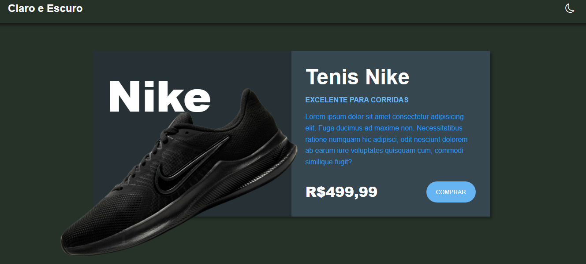

<h1 align="center">Dark Mode</h1>

## 📘 Sobre

O **Dark Mode** tem como funcionalidade demonstrar o uso do modo escuro em uma página e salvar as preferências de tema escuro ou claro utilizando LocalStorage.

## 🔨 Ferramentas

- HTML
- CSS
- JavaScript